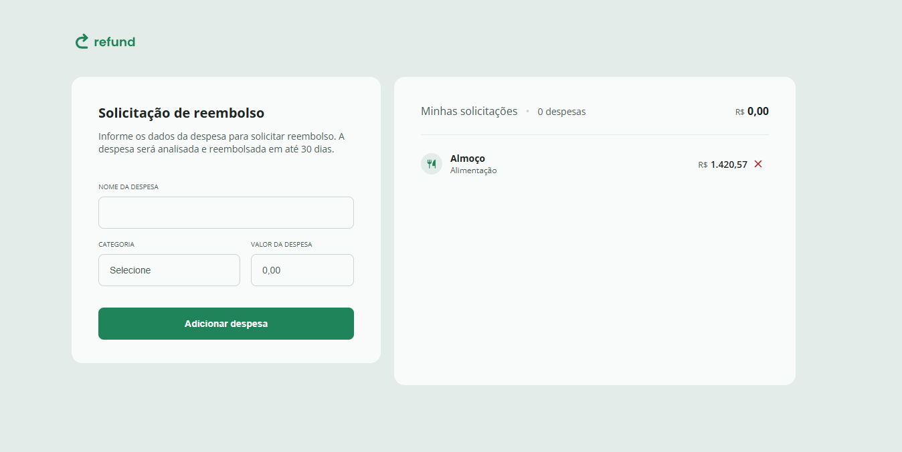

  

Projeto de template de reembolso desenvolvido durante as aulas de JavaScript na Rocketseat.

  <a href="#-tecnologias">Tecnologias</a>&nbsp;&nbsp;&nbsp;|&nbsp;&nbsp;&nbsp;
  <a href="#-projeto">Projeto</a>&nbsp;&nbsp;&nbsp;|&nbsp;&nbsp;&nbsp;
  <a href="#memo-licença">Licença</a>

[🔗 Clique aqui para acessar](https://natanjalmeida99.github.io/Refund-template/)

  

 

  

## 🚀 Tecnologias

Esse projeto foi desenvolvido com as seguintes tecnologias:

- HTML
- CSS
- JavaScript

## Projeto

Nesse projeto iremos desenvolver um template de reembolso desenvolvido para praticar o nosso conhecimento com o JavaScript!

